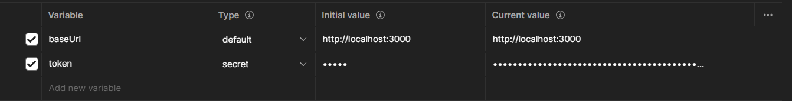

# News Web Scrapper

## Description

A webscrapper that takes news articles from major news outlets and provides an API for getting the news articles by category or outlet.

## Installation

1. Clone repo
2. Create env file

    ```bash
    cp .env.example .env
    ```

3. Generate APP KEY

    ```bash
    openssl rand -base64 32
    ```

4. Update APP_KEY in .env with results from 3
5. Create Database and set database in .env

    ```bash
    DB_HOST=127.0.0.1
    DB_PORT=3306
    DB_DATABASE=db_name
    DB_USERNAME=username
    DB_PASSWORD=password
    ```

6. Install node modules

    ```bash
    npm install
    ```

7. Run the app using the options provided in the [Running the app](#running-the-app) section
8. Seed users table

    ```bash
    npm run seed
    ```

## Running the app

```bash
# development
$ npm run start

# watch mode
$ npm run start:dev

# production mode
$ npm run start:prod
```

## Postman Collection

This repo contains a postman collection (postman_collection.json) located in the `docs` folder you can import into postman to see all the enpoints available

You will need to create an environment with variables baseUrl and token as shown in the image below


